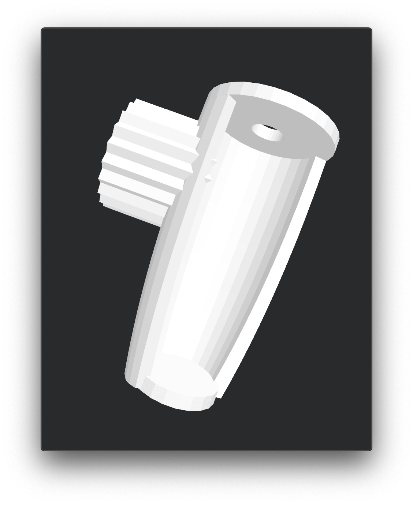
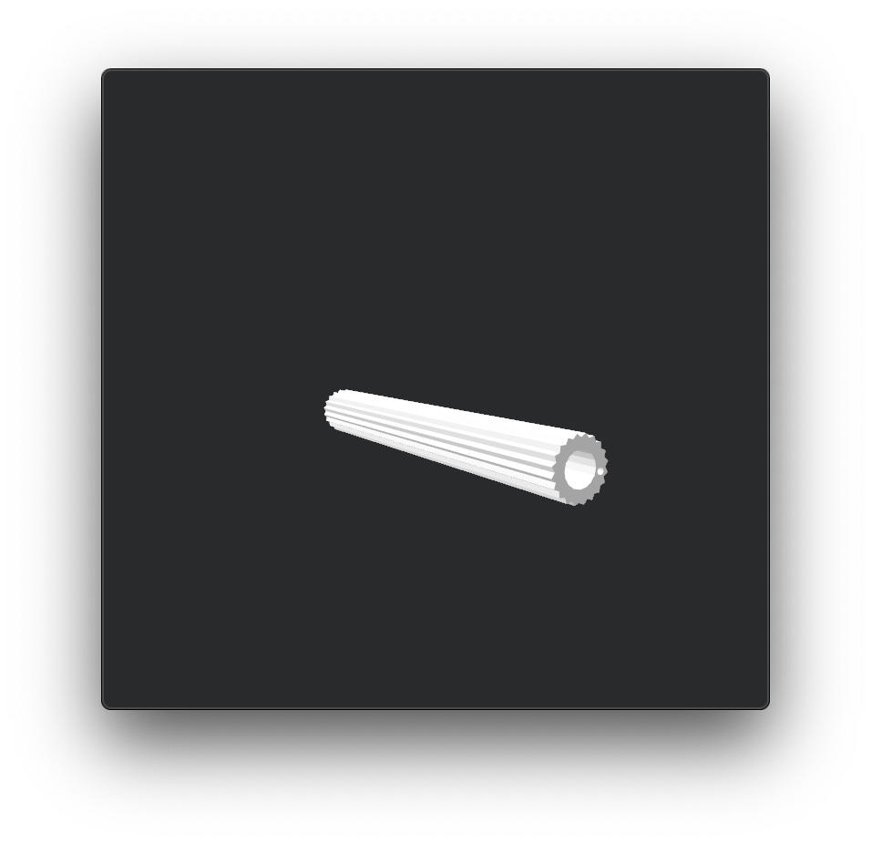
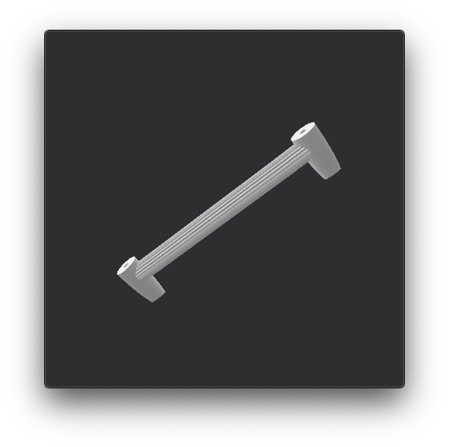

# Dash Accessory Bar
This is an attachment with a grooved bar that can be attached to windshield bolt mounts above the dash screen.

## Definitions
These terms are used in scad file and are important for understanding parameters and how to make changes to your model.

| Item | Description |
| --- | --- |
| __Adapter__ | Conic portion of the attachment that is bolted to the top of the windscreen post |
| __Bar__ | Cylinder that stretches between the two windscreen mounts |
| __Bar Inner Hole__ | The hole inside of the bar used to insert aluminum tube or rod for additional strength |
| __Washer__ | Circle with a hole on the bolt side of the adapter |
| __End-Cap__ | Circle that covers the rider side of the adapter |
| __Cone__ | Conic shape between the washer and end-cap |
| __Anti-Roll Hole__ | Hole through the entire accessory bar for a pin that will prevent the bar from rolling |
| __Rick Bar__ | Grooved portion of the cylinder of the adapter |
| __Wall Thickness__ | Thickness of the washer, cone, and end-cap walls |
| __Margin__ | Tollerance added to windshield post side of the adapter and bar inner hole |

| Adapter | Bar |
| --- | --- |
| |  |

## Complete Accesory Bar

## My Build Notes
1.  Leave the adapter a little, probably less than 0.5 mm, larger and lined the inside with two-sided outdoor carpet tape.  This results in a snug fit, prevents rattling, and end-cap lifting.

2.  Cut a thin nail to about 8mm and super-glue into anti-roll hole.  

3.  Size the bar inner hole to fit a light rod cut to appropritate length to the full length of the adapter.  This provides a lot of additional strength.

## Parameter Notes
__Note__: Values in this repo are the ones used on my build.

Parameters in the 'Module parameters' section of dash_accessory_bar_v1.scad should be pretty self explanatory.  They allow you to change most of the values needed to build the model.  

One exception to this is the bezier curve of the adapter cone.  Changes to cone length, washer diameter, or end diameter will require that the bezier curve parameters are adjusted manually.  Pay special attention to the warning section of the screen_post_adapter() module.  

All parameters that start with *prv_* are not meant to be modified when changing model parameters.  Only change these values if you're sure that they must be adjusted and you know exactly why.